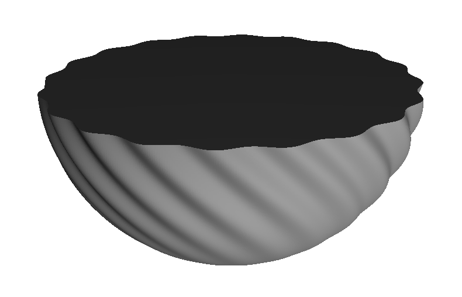
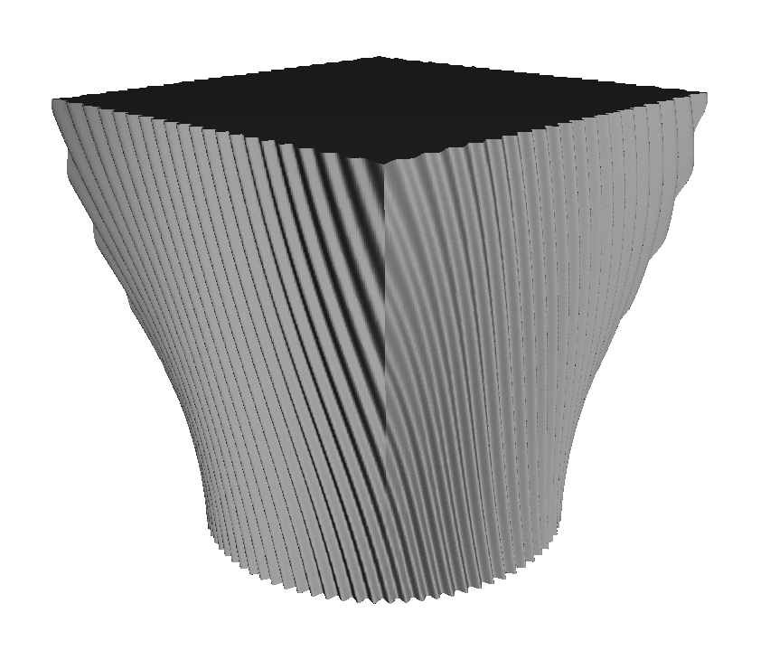
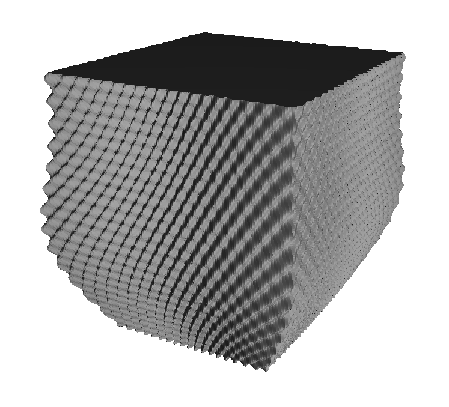
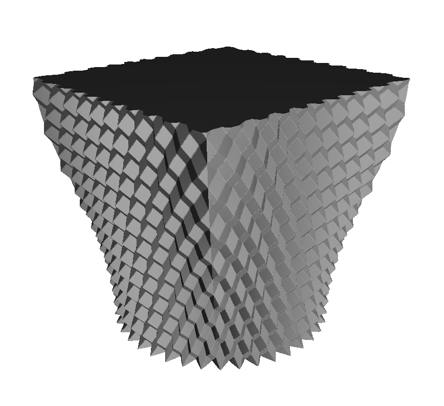

# vasestl

An application for converting a 3D mathematical equation into an STL surface. Great for generating geometric shapes to print as vases, vessels or pots!

## Usage

> [!NOTE]
> See the examples directory for samples of `r` functions and constants to use as per the instructions below!

1. In `main.rs`, update the `r` function to define the shape you wish to model. The function is in polar co-ordinates: it receives an angle (radians; between 0 and 2π) and a z-height (between 0 and 1) and outputs a radius. For example, to define a cylinder of radius 20:

   ```rust
   fn r(t: f32, z: f32) -> f32 {
       20
   }
   ```

1. Near the top of `main.rs`, update the constants to define your parameters:

   - Rotational resolution
   - Height resolution
   - Total height
   - File output location

1. Run it

   ```shell
   cargo run --release
   ```

   Output is stored in `out/output.stl` by default.

1. Print the resulting STL file. Use vase mode in the slicer!

## Examples

### "Bowl"

Semi-spherical base with broad sine wave easing in



### "Inch"

Base shape circle lofting to square, with swept sine ripple



### "Spider"

Base shape is a loft between two rectangles, plus a bulbous broadening. Two sine waves add decoration. 



### "NJoy"

Base shape circle lofting to square, with diagonally opposed triangle waves

